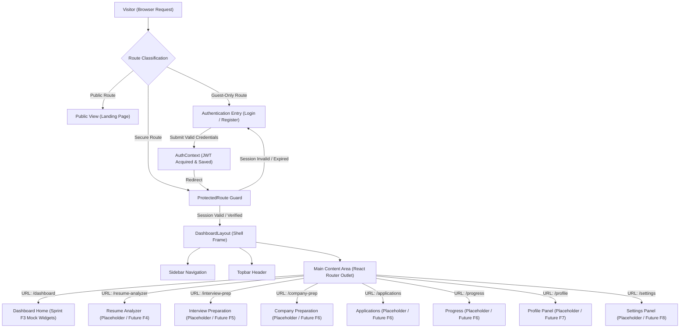
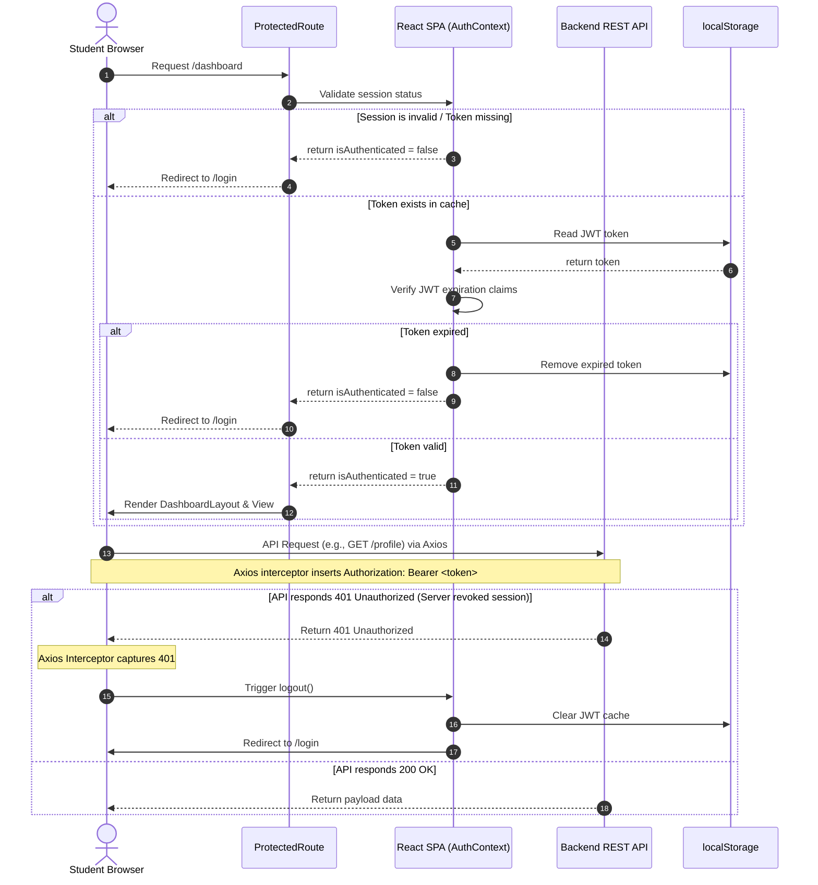
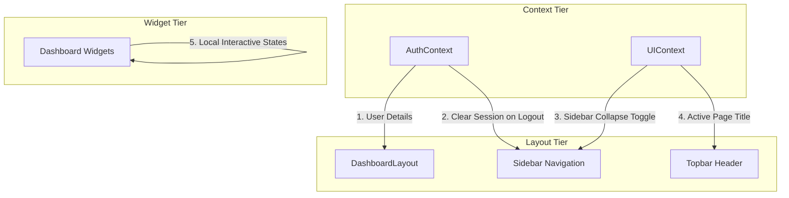
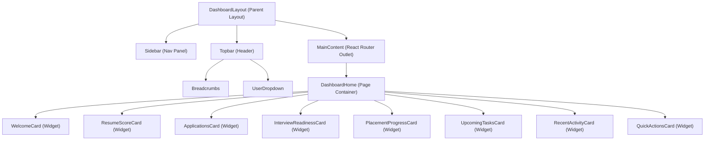
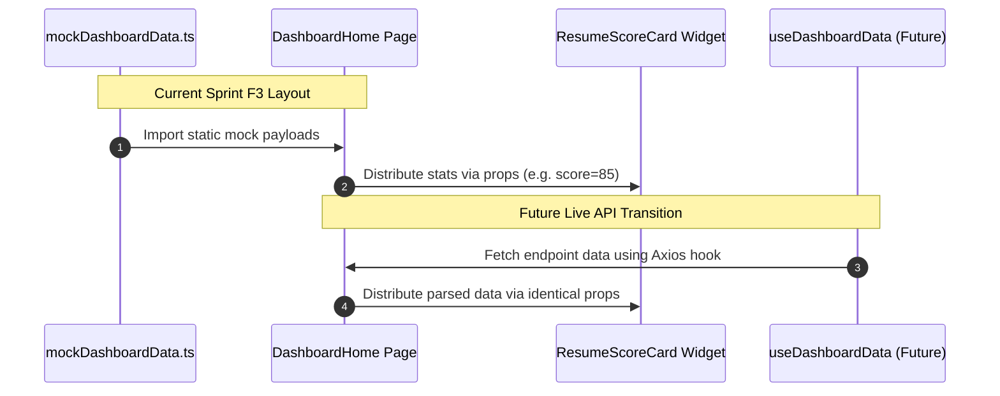

# Dashboard Architecture Blueprint: Authenticated Frontend

## Document Metadata
- **Document Version:** 1.0.0
- **Status:** Approved for Development (Frozen)
- **Scope:** Frontend Sprint F3: Authenticated Dashboard Foundation
- **Target Audience:** Frontend Engineers, QA Automation Teams, Technical Architects

---

## 1. Architecture Goals
The authenticated frontend architecture is designed to satisfy the following primary objectives:
- **Security:** Maintain strict route protection. Non-authenticated sessions must be automatically blocked from accessing private views and routed to authorization entry points.
- **Maintainability & Modular Scalability:** Support plug-and-play addition of future feature modules (Resume Analyzer, Mock Interview, Company Hub, Applications, Progress, Profile, Settings) without altering core navigation containers or shell layouts.
- **Performance Optimization:** Minimize render cycles within structural page elements. Ensure global states do not trigger cascade updates on non-dependent dashboard segments.
- **Clean Separation of Concerns:** Categorize data operations into security sessions (Auth), global display adjustments (UI), and local widget transitions (Component States).
- **Responsive Fluidity & Accessibility:** Satisfy WCAG 2.1 AA targets and provide consistent visual usability across Mobile, Tablet, Laptop, and Desktop screens.

---

## 2. High-Level System Architecture
The application transitions users from public access zones to protected views using an authorization gateway layer. Below is the master architecture flow:



---

## 3. Dashboard Shell Architecture
The authenticated workspace is contained within the `DashboardLayout` shell. This shell composes structural layouts and acts as the frame for internal child routes:

- **DashboardLayout (Container):** The master layout element. It defines screen grids, injects global stylesheets, resets document heights, and configures view scrolls.
- **Sidebar (Navigation Panel):** Left-hand drawer presenting the list of pages. Supports collapsible resizing states (expanded vs. collapsed icon rail) on desktop viewports.
- **Topbar (Header Panel):** Horizontal status header displaying dynamic breadcrumbs, hamburger menu controls on mobile, page titles, and user profile action triggers.
- **Breadcrumb (System Trail):** Hierarchical text indicators reflecting the path location (e.g. `Home > Dashboard`).
- **MainContent (Outlet Container):** Designated viewport utilizing React Router's `<Outlet />` to render nested active views. Uses overflow settings to restrict outer layout scrolling.
- **Footer Strategy:** The authenticated view layout purposefully omits a static footer. Removing the footer maximizes vertical space for metric widgets and listings. Layout and copyright metadata are relocated inside the collapsible Sidebar footer.

---

## 4. Folder Architecture
Below is the folder structure mapped to satisfy the architecture requirements of the authenticated layout foundation:

```
frontend/
├── public/
├── src/
│   ├── api/
│   │   ├── index.ts              # API barrel exports
│   │   └── client.ts             # Axios client instantiation & interceptors configuration
│   ├── components/
│   │   ├── common/               # Global shared stateless UI widgets
│   │   │   ├── Breadcrumbs/
│   │   │   ├── UserDropdown/
│   │   │   └── StatusIndicator/
│   │   └── dashboard/            # Specialized dashboard layout widgets
│   │       ├── WelcomeCard/
│   │       ├── ResumeScoreCard/
│   │       ├── ApplicationsCard/
│   │       ├── InterviewReadinessCard/
│   │       ├── ProgressCard/
│   │       ├── TasksCard/
│   │       ├── ActivityCard/
│   │       └── QuickActionsCard/
│   ├── config/
│   │   └── env.ts                # Environment settings parsing
│   ├── constants/
│   │   ├── index.ts
│   │   ├── navigation.ts         # Sidebar menu config definitions
│   │   └── routes.ts             # Client-side routes constant list
│   ├── context/
│   │   ├── index.ts
│   │   ├── AuthContext.tsx       # Auth context provider & validation logic
│   │   └── UIContext.tsx         # Sidebar toggle, breadcrumbs, theme configuration
│   ├── hooks/
│   │   ├── index.ts
│   │   ├── useAuth.ts            # Shortcut hook to consume AuthContext
│   │   └── useUI.ts              # Shortcut hook to consume UIContext
│   ├── layouts/
│   │   ├── index.ts
│   │   ├── PublicLayout.tsx      # Landing page / Public wrapper
│   │   └── DashboardLayout.tsx   # Dashboard layout / Authenticated shell frame
│   ├── mock/
│   │   └── dashboardData.ts      # Unified mocked data source for widgets
│   ├── pages/
│   │   ├── index.ts
│   │   ├── public/               # Publicly accessible screens
│   │   │   ├── Landing/
│   │   │   ├── Login/
│   │   │   └── Register/
│   │   └── private/              # Restricted authenticated layouts
│   │       ├── DashboardHome/    # Dashboard landing view hosting grid widgets
│   │       └── Placeholders/     # Temporary fallback views for future sprints
│   │           ├── ResumePlaceholder/
│   │           ├── InterviewPlaceholder/
│   │           ├── CompanyPlaceholder/
│   │           ├── ApplicationsPlaceholder/
│   │           ├── ProgressPlaceholder/
│   │           ├── ProfilePlaceholder/
│   │           └── SettingsPlaceholder/
│   ├── routes/
│   │   ├── index.ts
│   │   └── AppRoutes.tsx         # Master Route configuration & guards tree
│   ├── styles/
│   │   └── index.css             # Main styling rules
│   ├── theme/
│   │   └── index.ts              # Material UI customized configurations
│   ├── types/
│   │   └── index.ts              # Global TypeScript models definitions
│   └── utils/
│       └── jwt.ts                # JWT extraction and validation scripts
```

---

## 5. Routing Architecture
The routing tree handles view accessibility classifications cleanly, defining boundaries between guest spaces and authenticated environments:

### Route Categories
1. **Public Routes:** Open to all users without credentials.
   - `/` (Landing Page)
   - `/404` (NotFound Page)
2. **Guest-Only Routes:** Only accessible when logged out. If an active user requests these, they are redirected to `/dashboard`.
   - `/login` (Login Form)
   - `/register` (User Signup)
   - `/forgot-password` (Password recovery recovery page)
   - `/verify-email` (Account validation endpoint check)
3. **Protected Routes:** Accessible only to verified sessions. Unauthenticated traffic is redirected to `/login`.
   - `/dashboard` (Dashboard Home widget layout)
   - `/resume-analyzer` (Future Sprint F4 module placeholder)
   - `/interview-prep` (Future Sprint F5 module placeholder)
   - `/company-prep` (Future Sprint F6 module placeholder)
   - `/applications` (Future Sprint F6 module placeholder)
   - `/progress` (Future Sprint F6 module placeholder)
   - `/profile` (Future Sprint F7 module placeholder)
   - `/settings` (Future Sprint F8 module placeholder)

### Route Metadata Strategy
Route configurations in `AppRoutes.tsx` incorporate custom metadata tags (e.g. `title`, `requiredRole`, `layoutMode`) inside layout boundaries. This strategy allows the `DashboardLayout` shell to read route descriptors programmatically and adjust Topbar page title states dynamically.

---

## 6. Authentication Flow
Authentication security validates sessions on initial boot, during route transitions, and on network transactions.

### Sequence Details
- **Credential Collection:** Login form collects student inputs, validates structures via Zod schemas, and posts details to backend `/auth/login`.
- **JWT Storage:** Secure token is retrieved, validated client-side for expiration, and stored in browser memory cache.
- **Interceptors:** Axios client instance injects `Authorization: Bearer <token>` in the HTTP headers of all API transactions automatically.
- **Expiration and Revocation:** Token check operations verify token validity before each route transition. If the backend returns a `401 Unauthorized` response, the interceptor clears local cache and redirects to `/login`.

### Authentication Flow Diagram


---

## 7. State Management Architecture
To prevent unnecessary re-render calculations across complex views, state operations are isolated based on three clear scopes of responsibility:

### AuthContext (Security Scope)
- **Primary Role:** Session validation, identity caching, and credential processing.
- **Managed Properties:** `currentUser`, `token`, `isAuthenticated`, `loading`.
- **Core Operations:** Session login verification, local cache synchronization, and token revocation sweeps.

### UIContext (Presentation Scope)
- **Primary Role:** Shell container customization and global layout flags.
- **Managed Properties:** `sidebarCollapsed` status (desktop width state), `mobileDrawerOpen` toggle, `currentPageTitle` header indicator, dynamic breadcrumbs index, and theme settings.
- **Core Operations:** Sidebar collapse triggers, mobile navigation drawer visibility changes, and theme context adjustments.

### Local Component State (Component Scope)
- **Primary Role:** Isolated states within single views.
- **Usage:** Widget tab selections, filter search terms, input values, and hover transition indicators.

### State Interaction Layout


---

## 8. Dashboard Component Hierarchy
Authenticated structures are built using a component tree hierarchy to ensure clean render flows:



### Component Strategy
- **Parent Container Responsibility:** The page wrapper (`DashboardHome`) manages local data layers, coordinates page structures, and distributes read-only values to children.
- **Stateless Reusable Cards:** Widgets act as pure components. They consume data via props, render clean markup, and emit user interactions via callbacks, making them independent of business logic.

---

## 9. Data Flow Architecture
The layout uses a decoupled mock data system to support offline frontend development and ensure modular, predictable data flows:



### Future API Replacement Strategy
- **Interface Decoupling:** Define strict TypeScript types representing data schemas (e.g., `interface ResumeScoreInfo { score: number; checklist: string[] }`).
- **Data Hook Layer:** When endpoints stabilize in future sprints, a custom react hook (`useDashboardData`) will replace local mock file imports.
- **Widget Protection:** Because layout cards consume data via static props matching verified interfaces, the widgets themselves will require zero code modification when shifting from mock data to live API connections.

---

## 10. Responsive Architecture
The dashboard shell uses a mobile-first layout strategy to provide an optimal experience across different screen sizes:

### Breakpoint Metrics
- **Mobile (< 600px):** Single-column stacked widgets. Topbar hamburger control enabled; Sidebar hidden.
- **Tablet (600px - 899px):** Two-column widget grids. Topbar hamburger toggle enabled; Sidebar hidden.
- **Desktop (>= 900px):** Responsive multi-column widget layouts. Sidebar active (permanently docked left). Topbar hamburger hidden.

### Navigation Transition Behaviors
- **Desktop Sidebar:** In wide viewport configurations, the Sidebar is docked on the left. The `sidebarCollapsed` toggle adjusts the sidebar width between `260px` (expanded) and `72px` (collapsed), dynamically shifting adjacent page content margins.
- **Mobile Drawer:** In small viewports, the sidebar is removed from document grids. Clicking the hamburger icon in the Topbar opens a temporary slide-out layout drawer containing the navigation links.

---

## 11. Design Principles
- **Separation of Concerns:** Component styling remains restricted to theme setups, page layout frames dictate structures, contexts manage state logs, and services coordinate network processes.
- **Stateless Composition:** Keep layout widgets small, clean, and stateless to support easy component reuse.
- **WCAG AA Compliance:** Deliver clear color contrast, keyboard navigation hooks on buttons, and semantic layouts (`<aside>`, `<header>`, `<main>`, `<nav>`).
- **Performance Optimization:** Prevent container redraw operations by managing Auth and UI contexts independently. Optimize initial loading times through route-level lazy loading.

---

## 12. Future Extension Strategy
The `DashboardLayout` shell utilizes dynamic routing configurations to support future feature additions. Page items (e.g. Resume Analyzer, Interview Preparation) plug directly into the shell framework:

1. **Route Mapping:** Add child paths under the `DashboardLayout` route within `AppRoutes.tsx`.
2. **Page Injection:** Replace placeholder views (e.g. `ResumePlaceholder`) with live components.
3. **No Shell Modifications:** Because the layout shell reads navigation arrays and outlets dynamically, new page views can be added or updated without modifying `DashboardLayout`, `Sidebar`, or `Topbar` components.

---

## 13. Architecture Decision Records (ADR)

### ADR 01: Nested Client Routing
- **Context:** Authenticated features require identical layout frames, navigation elements, and headers. Duplicating layouts across every page causes maintenance overhead.
- **Decision:** Implement nested routing via React Router DOM's `<Outlet />` component in the `DashboardLayout` shell.
- **Consequences:** Provides a single, clean layout frame. Route transitions update content frames dynamically, keeping sidebar states static and reducing DOM updates.

### ADR 02: Separated Auth & UI Contexts
- **Context:** Authentication operations require global state access. Layout properties (like sidebar collapse states) must also be accessible globally.
- **Decision:** Split these domains into two distinct providers: `AuthContext` and `UIContext`.
- **Consequences:** Separating context domains ensures layout updates do not trigger credential recalculations. This avoids auth token validation checks on simple UI actions, optimizing performance.

### ADR 03: Local Mock Data Layer during Sprint F3
- **Context:** The frontend dashboard must be styled and tested before live dashboard metrics endpoints are implemented on the backend.
- **Decision:** Use a centralized mock data layer (`mockDashboardData.ts`) to populate all dashboard widgets during Sprint F3.
- **Consequences:** Decouples frontend development from backend schedules, enables offline testing, and ensures layout validation can proceed without active database connections.

### ADR 04: Component Composition for Dashboard Shell
- **Context:** Multiple modules share navigation rails.
- **Decision:** Keep Sidebar, Topbar, and MainContent as distinct components composed in the shell.
- **Consequences:** Maximizes UI reuse and isolates layout modifications.

---

## 14. Validation Checklist
- [ ] **Auth Guards:** Accessing any protected route (e.g. `/dashboard`) without an active session redirects to `/login`.
- [ ] **Logout Flow:** Triggering the logout action clears storage cache, updates auth contexts, and routes to `/login`.
- [ ] **Axios Interceptor:** Network transactions contain `Authorization: Bearer <token>` in the HTTP headers.
- [ ] **Responsive Layouts:** Grid columns and navigation elements adapt correctly when transitioning from mobile viewports to desktop sizes.
- [ ] **State Separation:** Toggling the sidebar collapsed state does not trigger re-renders in nested dashboard widgets.
- [ ] **Performance Sign-off:** Production bundle build completes successfully with all individual page modules lazy-loaded.
