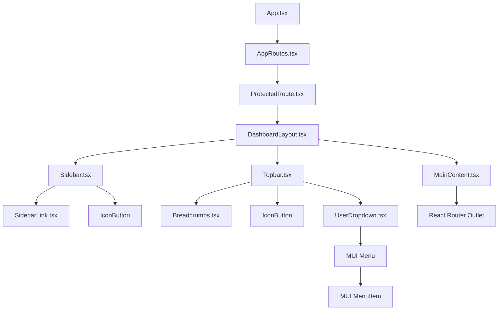
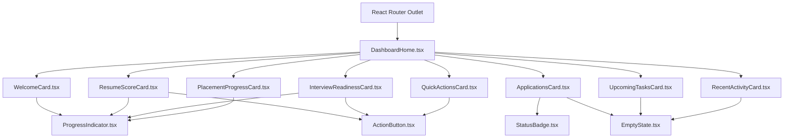
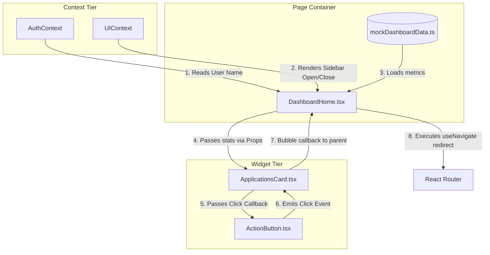

# Dashboard Component Specification

## Document Metadata
- **Version:** 1.0.0
- **Status:** Frozen (Approved for Frontend Implementation)
- **Scope:** Frontend Sprint F3: Authenticated Dashboard Component Specifications
- **References:**
  - [Sprint_F3_Project_Plan.md](file:///d:/placement-platform/docs/frontend/Sprint_F3/Sprint_F3_Project_Plan.md)
  - [Dashboard_Architecture.md](file:///d:/placement-platform/docs/frontend/Sprint_F3/Dashboard_Architecture.md)
  - [Dashboard_Wireframes.md](file:///d:/placement-platform/docs/frontend/Sprint_F3/Dashboard_Wireframes.md)

---

## 2. Component Design Principles

To ensure maintainability, testability, and responsiveness, the implementation of Sprint F3 components adheres to the following core principles:

- **Single Responsibility Principle (SRP):** Each component handles exactly one aspect of the user interface. Layout containers handle structural spacing, shared components handle pure representation, and dashboard pages coordinate local data states.
- **Component Composition:** Complex layouts are assembled by nesting simple components rather than creating massive monolithic files. The `DashboardLayout` aggregates the `Sidebar`, `Topbar`, and `MainContent`, which dynamically hosts page children.
- **Stateless vs. Stateful Components:** Presentation widgets (e.g., `ResumeScoreCard`, `ActionButton`) are designed as stateless ("dumb") components that consume props and emit user interactions via callback events. Data fetching, global configuration checkouts, and layout controls are reserved for Context Providers (`AuthContext`, `UIContext`) and Page Containers (`DashboardHome`).
- **Accessibility-First Design (A11y):** Accessibility is built into the component API from day one. All interactive components must accept `aria-*` tags, manage focus states via keyboard tabIndex, and support styling constraints under the system's `prefers-reduced-motion` media queries.
- **Reusability:** Shared elements (buttons, metrics panels, indicators) are extracted into `/components/common/` to prevent duplication, maintain uniform branding, and speed up future layout additions.
- **Separation of Concerns:** Component styling remains restricted to CSS Modules or styled Material UI configs, local event handlers dictate interaction logic, contexts coordinate state logs, and types declare APIs.

---

## 3. Component Classification

Sprint F3 components are classified into six distinct tiers:

1. **Layout Components:** Top-level containers managing viewport structures, scroll margins, and responsive layouts.
2. **Navigation Components:** Items enabling page transitions (e.g. menus, drawer layouts, breadcrumbs).
3. **Dashboard Pages:** Main view canvases containing aggregated collections of child widgets.
4. **Widget Components:** Domain-specific metrics cards populating the primary dashboard landing grid.
5. **Shared Components:** General-purpose, highly reusable basic blocks (buttons, indicators, loaders).
6. **Placeholder Components:** Temporary static views representing views scheduled for implementation in later sprints (Sprints F4–F8).

---

## 4. Layout & Navigation Components

Below are the detailed specifications for the authenticated dashboard outer shell components:

### 4.1. DashboardLayout
- **Purpose:** Acts as the outer frame and structural grid container for all authenticated features.
- **Responsibilities:**
  - Injects global theme variables, sets root height (`100vh`), and configures base body scrolls.
  - Dynamically adjusts main grid paddings according to screen sizes and sidebar states.
- **Parent Component:** Root `AppRoutes` (nested router boundary).
- **Child Components:** `Sidebar`, `Topbar`, `MainContent`.
- **Props:** None (renders nested children via React Router `<Outlet />`).
- **Events:** None.
- **Dependencies:** `UIContext` (reads sidebar collapse states and mobile drawer toggle flags).
- **Accessibility Notes:** Semantic layout container (`<div id="dashboard-root">`). Uses `aria-hidden` when mobile drawer overlays are active.
- **Future Extension Points:** Theme injection and layout customizations based on user preferences.

### 4.2. Sidebar
- **Purpose:** Left-hand navigation panel listing core platform views.
- **Responsibilities:**
  - Renders brand logo and navigational item list.
  - Controls expanded (260px) and collapsed (72px) widths on desktop screen sizes.
  - Slides out of view and toggles drawer overrides on mobile viewports.
- **Parent Component:** `DashboardLayout`.
- **Child Components:** `SidebarLink`, `ActionButton` (toggle control), `Divider`.
- **Props:** None.
- **Events:**
  - `onCollapseToggle()`: Emits click to change global sidebar display settings.
- **Dependencies:** `UIContext` (reads/writes state), `AuthContext` (triggers logout), Lucide React (navigation icons).
- **Accessibility Notes:** Wrapped in `<aside aria-label="Main Navigation">`. Supports keyboard list navigation. Active items use `aria-current="page"`.
- **Future Extension Points:** Badges on menu items to display notification counts (e.g. active applications count).

### 4.3. Topbar
- **Purpose:** Top horizontal header displaying active location details and user actions.
- **Responsibilities:**
  - Displays hamburger menu control on mobile/tablet.
  - Renders dynamic breadcrumbs tracking active routes.
  - Renders user dropdown button showing current session avatar.
- **Parent Component:** `DashboardLayout`.
- **Child Components:** `Breadcrumbs`, `UserDropdown`, `IconButton` (Hamburger/Theme).
- **Props:** None.
- **Events:** None.
- **Dependencies:** `UIContext` (toggles drawer, reads title), `AuthContext` (retrieves session user details).
- **Accessibility Notes:** Wrapped in semantic `<header aria-label="Dashboard Topbar">`. Hamburger menu utilizes descriptive `aria-label="Open menu drawer"`.
- **Future Extension Points:** Integration of live header notification list and search bars.

### 4.4. Breadcrumbs
- **Purpose:** Hierarchical navigation indicator tracing user path locations.
- **Responsibilities:**
  - Parses the current browser path and maps routing URLs to human-readable names.
  - Renders links to parent views dynamically.
- **Parent Component:** `Topbar`.
- **Child Components:** `Link` (Material UI).
- **Props:**
  - `separator?: React.ReactNode` (defaults to `/` or `ChevronRight`).
- **Events:** None.
- **Dependencies:** React Router DOM (consumes active location logs).
- **Accessibility Notes:** Contained inside `<nav aria-label="Breadcrumb">`.
- **Future Extension Points:** Custom dynamic breadcrumb titles derived from active resource names.

### 4.5. MainContent
- **Purpose:** Scrollable container frame hosting nested page views.
- **Responsibilities:**
  - Configures container bounds, height (`calc(100vh - 64px)`), and sets scroll parameters.
  - Handles route outlet transitions.
- **Parent Component:** `DashboardLayout`.
- **Child Components:** React Router DOM `<Outlet />`.
- **Props:** None.
- **Events:** None.
- **Dependencies:** React Router DOM.
- **Accessibility Notes:** Semantic container wrapped in `<main id="main-content" tabindex="-1">`.
- **Future Extension Points:** Animation wrappers (Framer Motion) for page transition transitions.

### 4.6. UserDropdown
- **Purpose:** User avatar button opening session configurations menu.
- **Responsibilities:**
  - Displays user profile avatar image and name.
  - Toggles profile, settings, and logout quick list items.
- **Parent Component:** `Topbar`.
- **Child Components:** `Menu` (MUI), `MenuItem`.
- **Props:** None.
- **Events:** None.
- **Dependencies:** `AuthContext` (triggers `logout()` and retrieves user metadata).
- **Accessibility Notes:** Button sets `aria-haspopup="true"` and `aria-expanded` reflecting dropdown display status.
- **Future Extension Points:** Session switching or quick status configuration indicators.

---

## 5. Dashboard Pages

### 5.1. DashboardHome
- **Purpose:** Aggregates and arranges the core student dashboard metrics.
- **Responsibilities:**
  - Imports mock data parameters from `mockDashboardData`.
  - Distributes structured metrics to specific widgets via props.
  - Arranges widgets within the responsive 12-column grid layout.
- **Parent Component:** React Router Route wrapper `/dashboard`.
- **Child Components:** `WelcomeCard`, `ResumeScoreCard`, `InterviewReadinessCard`, `PlacementProgressCard`, `ApplicationsCard`, `UpcomingTasksCard`, `RecentActivityCard`, `QuickActionsCard`.
- **Props:** None.
- **Events:** None.
- **Dependencies:** MUI `Grid` components, Unified Mock Data layer.

### 5.2. Placeholder Components
To support modular routing development in Sprint F3, all non-dashboard private routes render static placeholder views.
- **Placeholder Views:**
  - `ResumePlaceholder` (`/resume-analyzer`)
  - `InterviewPlaceholder` (`/interview-prep`)
  - `CompanyPlaceholder` (`/company-prep`)
  - `ApplicationsPlaceholder` (`/applications`)
  - `ProgressPlaceholder` (`/progress`)
  - `ProfilePlaceholder` (`/profile`)
  - `SettingsPlaceholder` (`/settings`)
- **Structure:**
  ```tsx
  interface PlaceholderProps {
    pageTitle: string;
    description: string;
  }
  ```
- **Responsibilities:**
  - Render a clear screen header detailing page title and location.
  - Render an illustration placeholder with standard subtext ("This feature is scheduled for release in a future Sprint").
  - Provide a primary CTA button: "Return to Dashboard" (redirects path back to `/dashboard`).

---

## 6. Widget Specifications

### 6.1. WelcomeCard
- **Purpose:** Greets the user, highlights the target role, and shows overall preparation status.
- **Displayed Data:** User name, target career title, readiness percentage score.
- **Props Interface:**
  ```typescript
  interface WelcomeCardProps {
    userName: string;
    targetRole: string;
    readinessScore: number;
    loading?: boolean;
  }
  ```
- **Events:** None.
- **Responsive Behavior:** Horizontal row on desktop (`md`+); wraps to vertical block on mobile (`xs`).
- **Loading State:** rectangular skeleton matching outer size (height: 140px).
- **Empty State:** N/A (defaults to fallback anonymous text if properties are undefined).
- **Error State:** N/A.
- **Future API Mapping:** Maps to GET `/api/v1/dashboard/welcome` (extracts profile properties).
- **Accessibility Notes:** Visual progress bar includes `aria-valuenow`, `aria-valuemin`, and `aria-valuemax`.
- **Testing Notes:** Verify that name text renders correctly and progress bar represents `readinessScore` percentage.

### 6.2. ResumeScoreCard
- **Purpose:** Displays resume ATS score metrics and checklist status.
- **Displayed Data:** Latest ATS score, rating text, checklist warning count, date analyzed.
- **Props Interface:**
  ```typescript
  interface ResumeScoreCardProps {
    atsScore: number;
    ratingText: 'Excellent' | 'Good' | 'Needs Improvement' | 'Critical';
    pendingItemsCount: number;
    lastAnalyzedDate: string;
    onAnalyzeClick: () => void;
    loading?: boolean;
  }
  ```
- **Events:**
  - `onAnalyzeClick()`: Triggers resume upload/analysis wizard redirection.
- **Responsive Behavior:** Spans 4 columns on desktop, 6 columns on tablet, 12 columns on mobile.
- **Loading State:** Radial progress indicator skeleton with text block replacements.
- **Empty State:** Displays `EmptyState` component with prompt: "No Resume Uploaded. Upload your resume to calculate your initial score."
- **Error State:** Renders error banner with retry option if score fails to process.
- **Future API Mapping:** GET `/api/v1/resume/latest-score`.
- **Accessibility Notes:** Circular gauge maps description via `aria-label="Resume ATS Score: 85 out of 100"`.
- **Testing Notes:** Confirm button action triggers routing handler and score triggers warning thresholds appropriately.

### 6.3. InterviewReadinessCard
- **Purpose:** Shows mock interview practice statistics.
- **Displayed Data:** Completed mock count, suggested mocks total, readiness score, next recommended prep session.
- **Props Interface:**
  ```typescript
  interface InterviewReadinessCardProps {
    completedMocks: number;
    targetMocks: number;
    readinessPercentage: number;
    nextRecommendedSession: string;
    onPracticeClick: () => void;
    loading?: boolean;
  }
  ```
- **Events:**
  - `onPracticeClick()`: Redirection handler to interview simulator screen.
- **Responsive Behavior:** Spans 4 columns on desktop, 6 columns on tablet, 12 columns on mobile.
- **Loading State:** Layout matching content block using standard pulsing skeletons.
- **Empty State:** Shows empty placeholder detailing "No mock interviews completed yet. Start with our baseline test."
- **Error State:** Falls back to error text container with reload actions.
- **Future API Mapping:** GET `/api/v1/interview/readiness-summary`.
- **Accessibility Notes:** Action button reads: `aria-label="Start practicing recommended mock session: System Design"`.
- **Testing Notes:** Ensure mock count fractions align and percentage meter renders the correct width.

### 6.4. PlacementProgressCard
- **Purpose:** Displays progress meters for all preparation milestones.
- **Displayed Data:** Progress values (Resume, Interview, Profile).
- **Props Interface:**
  ```typescript
  interface PlacementProgressCardProps {
    resumeProgress: number;
    interviewProgress: number;
    profileProgress: number;
    onDetailedProgressClick: () => void;
    loading?: boolean;
  }
  ```
- **Events:**
  - `onDetailedProgressClick()`: Navigation trigger routing to full progress detail page.
- **Responsive Behavior:** Spans 4 columns on desktop, 6 columns on tablet, 12 columns on mobile.
- **Loading State:** Three stacked line loaders representing each progress dimension.
- **Empty State:** N/A (displays 0% progress values by default).
- **Error State:** Standard container boundary block.
- **Future API Mapping:** GET `/api/v1/dashboard/progress-breakdown`.
- **Accessibility Notes:** Progress lines utilize distinct semantic HTML containers wrapping progress parameters.
- **Testing Notes:** Assert values are capped between 0 and 100.

### 6.5. ApplicationsCard
- **Purpose:** Tracks student job applications status and calendar dates.
- **Displayed Data:** Metrics summary counts, details of the 2 most recent applications (company, role, status badge, date).
- **Props Interface:**
  ```typescript
  interface ApplicationItem {
    id: string;
    companyName: string;
    roleTitle: string;
    status: 'Applied' | 'In Progress' | 'Interview Scheduled' | 'Offer Received' | 'Rejected';
    updatedDate: string;
  }

  interface ApplicationsCardProps {
    activeCount: number;
    interviewingCount: number;
    offersCount: number;
    latestApplications: ApplicationItem[];
    onViewAllClick: () => void;
    loading?: boolean;
  }
  ```
- **Events:**
  - `onViewAllClick()`: Dispatches request to navigate to `/applications`.
- **Responsive Behavior:** Spans 7 columns on desktop, 12 columns on tablet/mobile.
- **Loading State:** Block title skeleton with two stacked rectangular list item placeholders.
- **Empty State:** Renders `EmptyState` component: "No Active Applications. Explore matching companies and start applying."
- **Error State:** Displays network error boundary with reload trigger.
- **Future API Mapping:** GET `/api/v1/applications/summary`.
- **Accessibility Notes:** List is structured inside a semantic `<ul>` element. Items render inside `<li>`.
- **Testing Notes:** Validate list bounds; assert that only a maximum of 2 applications display even if props receive more.

### 6.6. UpcomingTasksCard
- **Purpose:** Displays critical action items and upcoming deadlines.
- **Displayed Data:** List of tasks (description, due date, completion status).
- **Props Interface:**
  ```typescript
  interface TaskItem {
    id: string;
    description: string;
    dueDate: string;
    completed: boolean;
  }

  interface UpcomingTasksCardProps {
    tasks: TaskItem[];
    onTaskToggle: (id: string) => void;
    onManageTasksClick: () => void;
    loading?: boolean;
  }
  ```
- **Events:**
  - `onTaskToggle(id)`: Dispatches action to mark a task as completed.
  - `onManageTasksClick()`: Redirection handler to tasks manager panel.
- **Responsive Behavior:** Spans 6 columns on desktop, 12 columns on tablet/mobile.
- **Loading State:** Stacked skeleton checkbox items.
- **Empty State:** Renders `EmptyState` illustration: "All caught up! No pending tasks for today."
- **Error State:** Renders retry alert box.
- **Future API Mapping:** GET `/api/v1/tasks/upcoming` & POST `/api/v1/tasks/{id}/toggle`.
- **Accessibility Notes:** Checkboxes utilize standard label associations and support keyboard space/enter triggers.
- **Testing Notes:** Mock toggling interactions and verify callback returns the correct task ID.

### 6.7. RecentActivityCard
- **Purpose:** Chronological feed logging user interactions and achievements.
- **Displayed Data:** Activity description, type tag, time label.
- **Props Interface:**
  ```typescript
  interface ActivityItem {
    id: string;
    description: string;
    type: 'upload' | 'test' | 'application' | 'milestone';
    relativeTime: string;
  }

  interface RecentActivityCardProps {
    activities: ActivityItem[];
    loading?: boolean;
  }
  ```
- **Events:** None.
- **Responsive Behavior:** Spans 6 columns on desktop, 12 columns on tablet/mobile.
- **Loading State:** Vertical line list items with small pulsing avatar circles.
- **Empty State:** Renders inline prompt: "No activity recorded yet."
- **Error State:** Error banner inside layout wrapper.
- **Future API Mapping:** GET `/api/v1/activity/recent`.
- **Accessibility Notes:** Uses semantic `<time>` tag for event timestamps.
- **Testing Notes:** Assert activities display chronologically matching inputs list order.

### 6.8. QuickActionsCard
- **Purpose:** Fast access hub routing user to major preparation tasks.
- **Displayed Data:** Launcher buttons (Upload resume, mock interview, explore companies).
- **Props Interface:**
  ```typescript
  interface QuickActionsCardProps {
    onActionClick: (actionKey: 'upload' | 'interview' | 'explore') => void;
    loading?: boolean;
  }
  ```
- **Events:**
  - `onActionClick(actionKey)`: Dispatches target action mapping to page routing redirects.
- **Responsive Behavior:** Spans 5 columns on desktop, 6 columns on tablet, 12 columns on mobile.
- **Loading State:** Three stacked skeleton buttons.
- **Empty State:** N/A (Static card layout).
- **Error State:** N/A.
- **Future API Mapping:** None.
- **Accessibility Notes:** Buttons carry descriptive tooltips and unique tab indices.
- **Testing Notes:** Ensure each action key fires the correct redirection handler.

---

## 7. Shared Components

To ensure design consistency and reduce codebase duplication, Sprint F3 utilizes a set of shared components:

- **StatisticCard:** Standard representation of numerical and text metrics. Renders titles, values, changes, and optional status indicators.
- **ProgressIndicator:** Reusable component wrapping linear and circular progress displays.
- **StatusBadge:** Renders colored status badges (e.g. green for Success, orange for Warning).
- **ActionButton:** A wrapper around Material UI Button adding a loading spinner state and disabling click events when processing.
- **SectionHeader:** Standard layout header containing a title, subtext description, and right-aligned CTA buttons.
- **EmptyState:** Unified visual template displaying a Lucide outline icon, title, description, and an optional primary button.
- **LoadingSkeleton:** Reusable skeleton lines and circles to build loading states.
- **ConfirmationDialog:** Standard popup prompt confirming high-risk actions (e.g. logout confirmation).

---

## 8. Component Hierarchy

### 8.1. Dashboard Layout Hierarchy


### 8.2. Dashboard Home & Widget Hierarchy


---

## 9. Component Communication

Component communication is structured unidirectionally. Data flows down from parent pages to children via props, and interactions flow up via callbacks. Global states are accessed through contexts:



---

## 10. State Ownership Matrix

| Component | Own State | AuthContext Usage | UIContext Usage | Mock Data Usage |
| :--- | :--- | :--- | :--- | :--- |
| **DashboardLayout**| None | None | Reads `sidebarCollapsed` | None |
| **Sidebar** | None | Triggers `logout()` | Reads `sidebarCollapsed` | None |
| **Topbar** | None | Reads `currentUser` | Reads `currentPageTitle` | None |
| **UserDropdown** | Popover open anchor | Triggers `logout()` | None | None |
| **DashboardHome** | Loading status | Reads `currentUser` | None | Imports all metrics |
| **WelcomeCard** | None | None | None | Reads welcome object |
| **ResumeScoreCard**| None | None | None | Reads resume object |
| **UpcomingTasksCard**| Completed items keys| None | None | Reads tasks array |
| **ApplicationsCard**| None | None | None | Reads apps array |
| **QuickActionsCard**| None | None | None | None (Static) |

---

## 11. Dependency Matrix

| Component | Depends On | Used By |
| :--- | :--- | :--- |
| **DashboardLayout**| `Sidebar`, `Topbar`, `MainContent`, `UIContext` | `AppRoutes` |
| **Sidebar** | `UIContext`, `AuthContext`, `SidebarLink` | `DashboardLayout` |
| **Topbar** | `Breadcrumbs`, `UserDropdown`, `UIContext` | `DashboardLayout` |
| **DashboardHome** | `mockDashboardData`, `WelcomeCard`, Widget Cards | `AppRoutes` |
| **WelcomeCard** | `ProgressIndicator` | `DashboardHome` |
| **ResumeScoreCard**| `ProgressIndicator`, `ActionButton`, `EmptyState`| `DashboardHome` |
| **ApplicationsCard**| `StatusBadge`, `ActionButton`, `EmptyState` | `DashboardHome` |
| **EmptyState** | `ActionButton` | Widget Cards, Placeholders |

---

## 12. Naming Conventions

To maintain a clean and standardized codebase, developers must adhere to the following naming rules:

- **Folders:** PascalCase representing the component name (e.g. `/components/dashboard/WelcomeCard/`).
- **Files:** PascalCase matching the component name (e.g. `WelcomeCard.tsx`). Supporting test files must be named `Component.test.tsx` (e.g. `WelcomeCard.test.tsx`).
- **Components:** PascalCase matching the file name. Renders must export single default components.
- **Hooks:** lowercase camelCase prefixed with `use` (e.g. `useAuth.ts`, `useUI.ts`).
- **Types & Interfaces:** PascalCase prefixed with component name or descriptive context, ending in `Props` or `State` (e.g. `WelcomeCardProps`, `SidebarLinkItem`).
- **Styles:** lowercase camelCase with suffix `.module.css` (e.g. `WelcomeCard.module.css`).
- **Barrel Exports:** `index.ts` files inside directories to barrel-export components, simplifying imports:
  ```typescript
  export { WelcomeCard } from './WelcomeCard';
  ```

---

## 13. Testing Guidelines

- **Unit Testing (Vitest + React Testing Library):**
  - Verify that stateless widgets render correctly when passed standard prop combinations.
  - Assert that default fallbacks display when props are left empty or undefined.
- **Accessibility Testing (jest-axe):**
  - All components must pass local accessibility audits:
    ```typescript
    const { container } = render(<WelcomeCard {...defaultProps} />);
    expect(await axe(container)).toHaveNoViolations();
    ```
- **Interaction Testing:**
  - Mock parent callback functions and verify they fire with the correct parameters when buttons are clicked (e.g. `onTaskToggle` returning task ID).
- **Responsive Testing:**
  - Assert components toggle layouts correctly when the window's `innerWidth` changes.
- **Snapshot Testing:**
  - Use snapshots for static components (e.g., `Breadcrumbs`, `SidebarLink`) to catch unintended markup changes.

---

## 14. Validation Checklist
- [x] All 8 widget names align with `Dashboard_Architecture.md`.
- [x] Folder structures and nested components reflect approved layouts.
- [x] All widgets define exact typescript prop interfaces.
- [x] Loading, Empty, and Error state specs are defined for every widget.
- [x] Component hierarchy and communication paths are modeled via Mermaid.
- [x] A11y notes are defined for every component, referencing WCAG 2.1 AA parameters.

## Future Extension Notes
When adding a new widget in future sprints (e.g., career orbit nodes or live notification panels), developers must define a stateless component structure with an independent props interface, add mock data elements to `mockDashboardData.ts`, and define a corresponding TypeScript type in `types/index.ts` before writing any implementation code.
