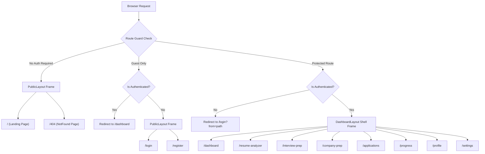
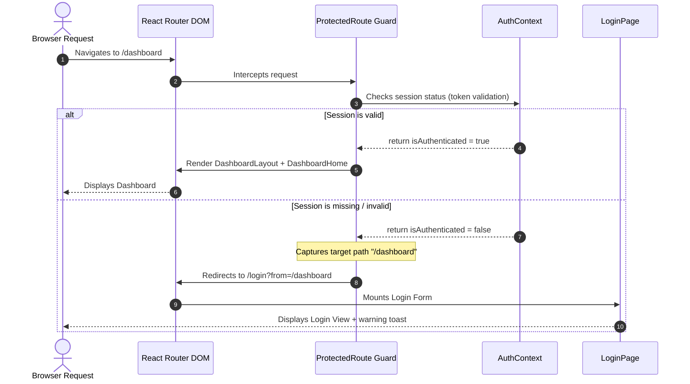

# Dashboard Routing Specification

## Document Metadata
- **Version:** 1.0.0
- **Status:** Frozen (Approved for Frontend Implementation)
- **Scope:** Frontend Sprint F3: Client-side routing, guards, and navigation architecture
- **References:**
  - [Sprint_F3_Project_Plan.md](file:///d:/placement-platform/docs/frontend/Sprint_F3/Sprint_F3_Project_Plan.md)
  - [Dashboard_Architecture.md](file:///d:/placement-platform/docs/frontend/Sprint_F3/Dashboard_Architecture.md)
  - [Dashboard_Wireframes.md](file:///d:/placement-platform/docs/frontend/Sprint_F3/Dashboard_Wireframes.md)

---

## 2. Routing Philosophy

The AI Placement Platform utilizes React Router DOM (v6) to implement client-side routing. The routing architecture is designed around four key guidelines:

- **Single Page Application (SPA) Experience:** Page changes do not trigger full-browser reloads. Navigation occurs via path manipulation in the browser's History API, enabling instantaneous visual updates.
- **Strict Route Protection:** Route authorization is verified before any component is rendered. Secure paths are wrapped in route guards, blocking unauthenticated traffic at the routing layer.
- **Nested Layout Boundaries:** Common user interface shells (like the dashboard frame) are shared across views using nested routes. Shared layouts are kept mounted while inner page contents are dynamically swapped, preventing unnecessary layout redraws.
- **Lazy Loading & Code Splitting:** Code is split at the route level. Page components are loaded dynamically on demand using `React.lazy()` and `React.Suspense`, minimizing the initial bundle size and accelerating page load times.

---

## 3. Route Categories

Application routes are divided into three distinct access categories:

### 3.1. Public Routes
Accessible by all visitors, regardless of authentication status.
- `/` (Landing Page)
- `/404` (NotFound Page)

### 3.2. Guest-Only Routes
Accessible only to unauthenticated visitors. If an authenticated user tries to navigate to these pages, they are redirected to `/dashboard`.
- `/login` (Sign In Form)
- `/register` (Sign Up Form)
- `/forgot-password` (Password Reset Request Form)
- `/verify-email` (Account Verification landing page)

### 3.3. Protected Routes
Accessible only to logged-in users with a valid JWT. Unauthenticated requests are intercepted and redirected to `/login`.
- `/dashboard` (Dashboard Home view showing metric widgets)
- `/resume-analyzer` (Resume check and ATS analysis dashboard placeholder)
- `/interview-prep` (Mock interview simulator placeholder)
- `/company-prep` (Company tracking index placeholder)
- `/applications` (Job applications tracking database placeholder)
- `/progress` (Milestone progress tracker placeholder)
- `/profile` (Personal, academic, and target job form placeholder)
- `/settings` (Preferences, notifications, and security configuration placeholder)

---

## 4. Route Tree

The routing tree structure and guard wrappers are configured as follows:



---

## 5. Route Metadata Strategy

To allow the `DashboardLayout` shell to dynamically customize the Topbar and track layout context, route definitions incorporate a custom `meta` configuration block:

```typescript
export interface RouteMeta {
  title: string;
  requiredRole?: 'STUDENT' | 'ADMIN';
  breadcrumbs: Array<{ label: string; path: string }>;
  layoutMode?: 'default' | 'focus';
}
```

### Route Metadata Definitions
- **title:** Renders the active page title in the Topbar (e.g. `title: "Resume Analyzer"`).
- **requiredRole:** Restricts access to specific user profiles (e.g., student vs. placement administrator).
- **breadcrumbs:** Defines the path hierarchy to render page breadcrumb trails dynamically.
- **layoutMode:** Dictates structural visibility. Set to `focus` to collapse the Sidebar and hide secondary panels for focus-oriented features (like mock interviews).

---

## 6. Route Naming Standards

To maintain consistency and searchability across the codebase, developers must adhere to the following routing standards:

- **URLs:** All path URLs must use `lower-kebab-case` and be singular (e.g. `/resume-analyzer`, `/company-prep`).
- **Route Constants:** Route URLs must be mapped inside `constants/routes.ts` as capital snake_case constants to prevent magic strings:
  ```typescript
  export const ROUTES = {
    PUBLIC: {
      LANDING: '/',
      NOT_FOUND: '/404',
    },
    GUEST: {
      LOGIN: '/login',
      REGISTER: '/register',
    },
    PRIVATE: {
      DASHBOARD: '/dashboard',
      RESUME: '/resume-analyzer',
      INTERVIEW: '/interview-prep',
      APPLICATIONS: '/applications',
      PROGRESS: '/progress',
      PROFILE: '/profile',
      SETTINGS: '/settings',
    }
  } as const;
  ```

---

## 7. Navigation Flow

### 7.1. Guard Interception Sequence
The sequence below illustrates how the application intercepts and handles unauthorized path changes:



---

## 8. Guard Implementations

### 8.1. ProtectedRoute Behaviour
The `ProtectedRoute` wraps secure layout components to ensure only authenticated users can access them:

- **Auth Verification:** Evaluates the `isAuthenticated` property from `useAuth()`.
- **Loading Fallback:** If `loading` is `true` (e.g., during startup token validation), the guard blocks rendering and displays a full-screen loading spinner.
- **Unauthorized Redirection:** If `isAuthenticated` is `false`, the guard redirects the user to `/login` using React Router's `<Navigate to="/login" replace state={{ from: location }} />`. This stores the attempted path, allowing the user to be redirected back to their target page after a successful login.

### 8.2. PublicOnlyRoute Behaviour
Also known as the Guest Guard, this component wraps public entry pathways (Login, Registration) to prevent logged-in users from accessing them:

- **Auth Verification:** Evaluates the `isAuthenticated` property from `useAuth()`.
- **Authenticated Redirection:** If `isAuthenticated` is `true`, the guard redirects the user directly to `/dashboard`.
- **Standard Rendering:** If `isAuthenticated` is `false`, the guard allows rendering of the guest view (e.g., Login form).

---

## 9. Authentication Redirect Rules

Client-side session events trigger the following routing actions:

- **Initial Login Success:** After validation, users are redirected to the path stored in the location state (`from`). If no redirect path is stored, they default to `/dashboard`.
- **Manual Logout:** Tapping the logout button dispatches `logout()` in the `AuthContext`, clearing localStorage, resetting session credentials, and redirecting the browser to `/login`.
- **Session Expiration (JWT Expiration):** The Axios interceptor catches `401 Unauthorized` responses. It dispatches a session clear action, displays a session expired notification, and redirects the user to `/login` with the current path stored in the `from` parameter.

---

## 10. Exception Handling

### 10.1. 404 Handling (Route Fallback)
If the browser requests a URL path that is not defined in the route configurations:
- A wildcard route (`*`) captures the request.
- The router automatically redirects the path to `/404`.
- The `NotFound` component renders, displaying a "Page Not Found" illustration and a primary CTA button: "Return to Home".

### 10.2. Unauthorized Handling (Permission Blocks)
If an authenticated user attempts to access a route that requires a specific role they do not have (e.g., a student trying to access `/admin/placement-dashboard`):
- The `ProtectedRoute` evaluates the active user's role against the route's `requiredRole` metadata parameter.
- If the roles do not match, the router blocks rendering and redirects the user to `/dashboard` with a warning toast alert reading: "Access Denied: You do not have permission to view that resource."

---

## 11. Future Route Expansion

To add new features (e.g., Sprint F4 Resume Analyzer detail logs, Sprint F5 Mock Interview logs) in future sprints, follow this extension protocol:

1. **Register Paths:** Define the path constant inside `/constants/routes.ts`.
2. **Setup Component Views:** Create the page component within the `/pages/private/` directory.
3. **Configure Route Guard:** Add the path under the `DashboardLayout` route wrapper in `AppRoutes.tsx`, wrapping it in the `<ProtectedRoute>` guard:
   ```tsx
   <Route path={ROUTES.PRIVATE.RESUME} element={<ResumeAnalyzerPage />} />
   ```
4. **Update Sidebar:** Add the path, title, and Lucide icon to `/constants/navigation.ts` to automatically display the new page link in the Sidebar navigation list.

---

## 12. Testing Strategy

- **Route Redirection Tests:** Verify that accessing protected routes (e.g., `/dashboard`) when logged out redirects the user to `/login`.
- **Guest Guard Redirect Tests:** Assert that navigating to `/login` with an active session redirects the user to `/dashboard`.
- **Dynamic Breadcrumb Verification:** Test that dynamic breadcrumbs render the correct page labels and URLs as routes change.
- **Lazy Loading Suspense Checks:** Verify that slow route transitions trigger the `<Suspense>` loading fallback correctly.

---

## 13. Validation Checklist
- [x] Routing structure is nested using React Router Outlet.
- [x] Wildcard fallback routes are configured to handle 404 errors.
- [x] Protected routes redirect unauthorized traffic to `/login` with target path state.
- [x] Route metadata parameters are structured to support dynamic breadcrumbs and topbar titles.
- [x] Naming conventions use lower-kebab-case consistently.

## Future Extension Notes
When implementing future admin panels or partner portals in Sprint F9, developers must register the new paths in `routes.ts`, configure the `requiredRole` metadata attribute to restrict access, and implement dynamic layouts to handle the specific layout requirements of different roles.
