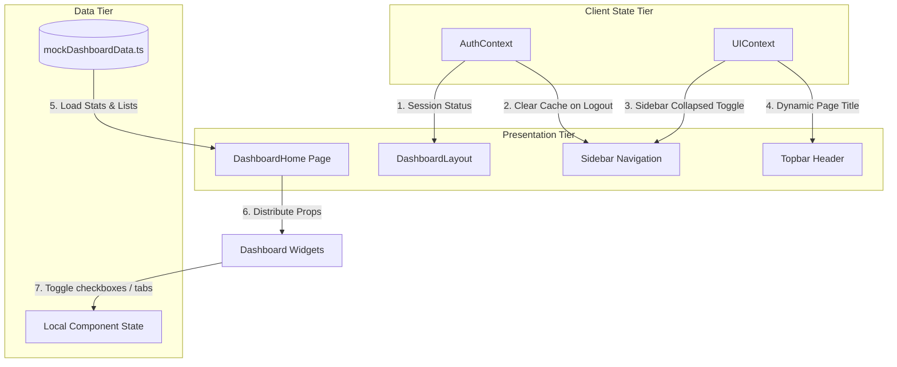
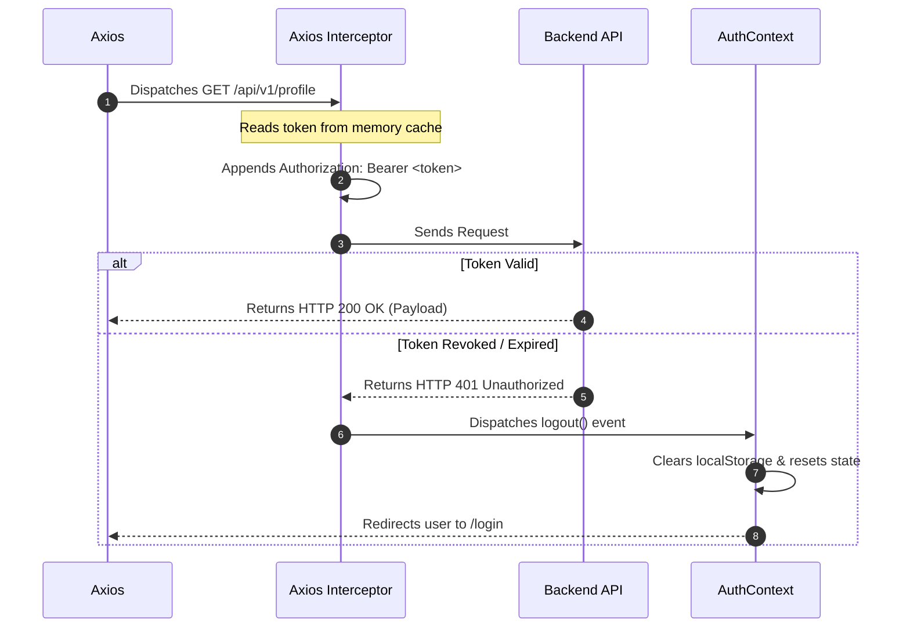

# Dashboard State Management Strategy

## Document Metadata
- **Version:** 1.0.0
- **Status:** Frozen (Approved for Frontend Implementation)
- **Scope:** Frontend Sprint F3: Context architectures, data flows, and performance rules
- **References:**
  - [Sprint_F3_Project_Plan.md](file:///d:/placement-platform/docs/frontend/Sprint_F3/Sprint_F3_Project_Plan.md)
  - [Dashboard_Architecture.md](file:///d:/placement-platform/docs/frontend/Sprint_F3/Dashboard_Architecture.md)
  - [Dashboard_Wireframes.md](file:///d:/placement-platform/docs/frontend/Sprint_F3/Dashboard_Wireframes.md)

---

## 2. State Management Goals

To support a scalable and performant Single Page Application (SPA), the state management architecture of Sprint F3 is designed to achieve the following goals:

- **Single Source of Truth:** Core domain states (such as active user sessions and global layout configurations) are maintained in centralized contexts, preventing discrepancies across components.
- **Render Performance Optimization:** Layout interactions (e.g. collapsing the sidebar) do not trigger re-renders in nested, data-dependent child widgets.
- **Decoupled Concerns:** Security access context (`AuthContext`), structural presentation settings (`UIContext`), and localized component inputs (`Local State`) are managed independently.
- **Offline Capabilities (Mock-Supported):** The data layer is decoupled from REST APIs. Presentation widgets consume mock data payloads, enabling rapid development and testing offline.

---

## 3. Architecture Overview

Application states are divided into three distinct layers of responsibility, as shown below:



---

## 4. AuthContext (Security Scope)

The `AuthContext` manages secure session configurations, token persistence, and HTTP request authorization headers.

### 4.1. Responsibilities
- Decodes JWT payloads on startup to extract user roles and expiration claims.
- Stores verified JWT tokens in browser localStorage for session persistence.
- Configures default Axios headers to attach token properties to all API requests automatically.
- Handles token expiration events, clearing local sessions and forcing logouts when active sessions expire.

### 4.2. State Schema
```typescript
interface AuthState {
  currentUser: User | null;
  token: string | null;
  isAuthenticated: boolean;
  loading: boolean;
}

interface User {
  id: string;
  email: string;
  name: string;
  role: 'STUDENT' | 'ADMIN';
}
```

### 4.3. Methods
- `login(credentials: LoginCredentials): Promise<void>`: Posts email/password to `/auth/login`, retrieves token payload, stores session, and routes to `/dashboard`.
- `logout(): void`: Clears browser storage, resets authorization headers, resets contexts, and redirects to `/login`.
- `refreshSession(): Promise<void>`: Validates active tokens on startup to resume active sessions.

### 4.4. Axios Interceptor Implementation
The interceptor dynamically injects JWT credentials into network requests and catches token revocation events:



---

## 5. UIContext (Presentation Scope)

The `UIContext` manages global layout configurations and UI states.

### 5.1. Responsibilities
- Synchronizes sidebar width states across desktop viewports.
- Manages temporary slide-out drawer visibility on tablet and mobile viewports.
- Updates Topbar headers dynamically with active page titles and breadcrumb trails.
- Tracks theme values (light vs. dark mode) and applies corresponding CSS variable overrides.

### 5.2. State Schema
```typescript
interface UIState {
  sidebarCollapsed: boolean;
  mobileDrawerOpen: boolean;
  currentPageTitle: string;
  breadcrumbs: Array<{ label: string; path: string }>;
  theme: 'light' | 'dark';
}
```

### 5.3. Layout State Toggles
- `toggleSidebarCollapsed()`: Collapses/expands the desktop sidebar, shifting main container margins.
- `setMobileDrawerOpen(open: boolean)`: Opens/closes the slide-out navigation panel on mobile.
- `updatePageHeader(title: string, crumbs: Breadcrumb[])`: Dynamically updates the Topbar title and breadcrumbs.
- `toggleTheme()`: Toggles the system theme state and writes settings to browser cache.

---

## 6. Local Component State

States that do not affect other components are managed locally within the respective files to prevent unnecessary re-render calculations:

- **Widget State:** Handles component-specific UI changes, such as tab selections in the Applications card or checked checkboxes in the Tasks card.
- **Form State:** Uses `React Hook Form` to manage form inputs and validate fields locally using `Zod` schemas before submission.
- **Temporary UI State:** Manages transient visual states, such as dropdown menus, popover positioning anchors, and active tooltip values.

---

## 7. Context Communication & Data Flow

To prevent render loop cascades, data operations are kept separate from UI state updates. In Sprint F3, data flows from the static mock data layer down to the widgets via props, keeping the presentation layer pure and stateless.

### Dynamic Rendering Flow
1. **Startup Validation:** The `AuthContext` initializes, verifies the JWT, and sets `isAuthenticated` to `true`.
2. **Layout Mounting:** The `DashboardLayout` checks the authentication status, mounts the structural frames, and reads the sidebar state from `UIContext`.
3. **Data Loading:** The `DashboardHome` container mounts, imports metrics from `mockDashboardData.ts`, and updates the local loading status.
4. **Prop Distribution:** Once loaded, `DashboardHome` passes the metrics to child widgets as props (e.g. `atsScore={85}`).
5. **UI Rendering:** Widgets render their presentation states and delegate user actions (clicks/redirects) back to the parent container via callback functions.

---

## 8. Performance Optimizations

To maintain a fast and responsive user interface, developers must follow these state management optimization rules:

### 8.1. Context Splitting Strategy
Global states are split into separate contexts (`AuthContext` and `UIContext`) to prevent layout changes from triggering authorization checks.
- If they were combined, toggling the sidebar would trigger re-renders in all components consuming user identity details.
- Splitting the contexts ensures layout changes are isolated to structural components, while authentication states remain static.

### 8.2. Component Memoization
- **React.memo:** Presentation cards (e.g. `ResumeScoreCard`) are wrapped in `React.memo` to prevent re-renders when parent states change, unless their own props have changed.
- **useCallback:** Event handlers passed to child widgets as callbacks are wrapped in `useCallback` to preserve reference identity across render cycles:
  ```typescript
  const handleTaskToggle = useCallback((id: string) => {
    // State update logic
  }, []);
  ```
- **useMemo:** Large datasets (like application logs lists) are filtered and formatted inside `useMemo` hooks to prevent recalculations on every render.

---

## 9. Future Integration Roadmap

### 9.1. Custom React Query Hooks (Future Sprints)
In future sprints, local mock data imports will be replaced with live API queries managed by React Query (`@tanstack/react-query`). This will introduce the following improvements:

- **useDashboardData Hook:** A custom hook to fetch and cache unified dashboard metrics:
  ```typescript
  export const useDashboardData = () => {
    return useQuery({
      queryKey: ['dashboard', 'metrics'],
      queryFn: fetchDashboardMetrics,
      staleTime: 5 * 60 * 1000, // Caches data for 5 minutes
    });
  };
  ```
- **Mutation Handling:** Actions (like ticking a task or uploading a resume) will use `useMutation` hooks, automatically refetching related queries to update the UI:
  ```typescript
  export const useToggleTaskMutation = () => {
    const queryClient = useQueryClient();
    return useMutation({
      mutationFn: toggleTaskApi,
      onSuccess: () => {
        queryClient.invalidateQueries({ queryKey: ['tasks', 'upcoming'] });
      },
    });
  };
  ```

---

## 10. Exception & Loading States

- **Error Boundaries:** Widget rendering errors are caught by React Error Boundaries wrapping each grid item. If a card fails, it renders an error placeholder without breaking the rest of the dashboard page.
- **Unified Skeletal Loaders:** When queries are fetching data, cards render skeleton loaders matching the exact size of the final content, preventing layout shifts.
- **Offline Fallbacks:** If a network request fails, the application falls back to cached data stored in localStorage, showing a warning banner: "Offline Mode: Showing cached data from {Timestamp}."

---

## 11. Testing Strategy

- **Context Provider Testing:** Mock the context providers and verify that consuming components receive the correct state values.
- **Authentication Action Tests:** Verify that calling `login()` updates the authentication state and stores the token in localStorage.
- **UI State Verification:** Assert that calling `toggleSidebarCollapsed()` updates the sidebar width and shifts the main container margins.
- **Memoization Verification:** Use Profiler tools to confirm that changing the sidebar collapse state does not trigger re-renders in nested dashboard widgets.

---

## 12. Validation Checklist
- [x] State concerns are split into separate `AuthContext` and `UIContext` providers.
- [x] Axios interceptors are configured to handle JWT headers and 401 logouts.
- [x] Global contexts are decoupled from presentation widgets using prop-driven communication.
- [x] Memoization strategies (`useCallback`, `useMemo`, `React.memo`) are defined.
- [x] Skeletons are used to handle loading states, preventing layout shifts.

## Future Extension Notes
When implementing Career Orbit visualizations in Sprint F6, developers must define a separate state hook, register keys in query cache managers, and map data using React Query without modifying the core `AuthContext` or `UIContext` providers.
