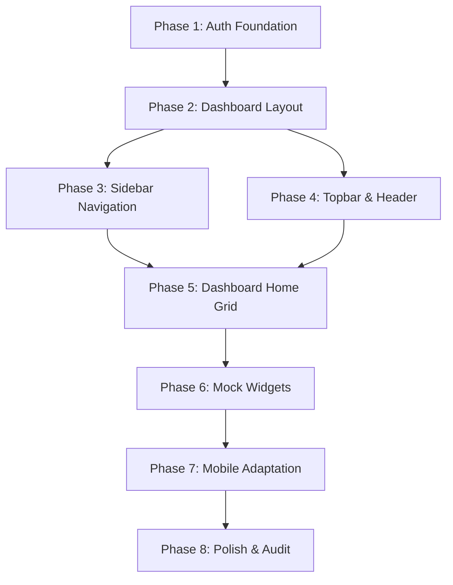

# Sprint F3 Implementation Roadmap

## Document Metadata
- **Version:** 1.0.0
- **Status:** Frozen (Approved for Development sequencing)
- **Scope:** Frontend Sprint F3: Milestones, sequencing details, and verification plans
- **References:**
  - [Sprint_F3_Project_Plan.md](file:///d:/placement-platform/docs/frontend/Sprint_F3/Sprint_F3_Project_Plan.md)
  - [Dashboard_Architecture.md](file:///d:/placement-platform/docs/frontend/Sprint_F3/Dashboard_Architecture.md)
  - [Dashboard_Wireframes.md](file:///d:/placement-platform/docs/frontend/Sprint_F3/Dashboard_Wireframes.md)

---

## 2. Sprint Overview

Frontend Sprint F3 focuses on building the authenticated dashboard foundation. Key deliverables include:

- **Security Gateways:** Token-based security context (`AuthContext`) and route guards (`ProtectedRoute`, `PublicOnlyRoute`).
- **Layout Shell:** Collapsible navigation sidebar and top bar header in `DashboardLayout`.
- **Dashboard Home:** Responsive layout grid populated by mock-data-driven widgets.
- **State Separation:** Separate contexts for security and UI preferences to optimize performance.

### Out of Scope Items
Active features (ATS analyzer parser, interview recording simulator, company hub matching, academic settings logs) are represented by static placeholder views in Sprint F3.

---

## 3. Implementation Philosophy

To minimize integration issues and ensure code quality, implementation follows these development principles:

- **Dependencies-First Ordering:** Base layers (auth guards, layout contexts) must be verified before building dependent UI components.
- **Atomic Verification:** Each phase is tested and verified independently before moving to the next phase.
- **Automated Quality Checks:** All phases must pass ESLint check audits, automated unit tests, and production build checks.
- **Strict Scope Control:** Implementation is focused on building structural layout files and widgets. No active API connections or dynamic logic should be added.

---

## 4. Development Sequence & Phase Specifications



---

### Phase 1: Authentication Foundation
- **Objective:** Build client-side authentication mechanisms, route guards, and Axios API configurations.
- **Deliverables:** `AuthContext`, `ProtectedRoute`, `PublicOnlyRoute`, Axios interceptors, JWT utility scripts.
- **Dependencies:** Backend Beta v1.0 auth endpoints.
- **Complexity:** High (requires secure token and route validation).
- **Risks:** Token synchronization issues, loop redirects.
- **Acceptance Criteria:**
  - Navigating to `/dashboard` when logged out redirects the user to `/login`.
  - Logging in stores the JWT in localStorage, initializes `AuthContext`, and redirects the user back to their target path.
  - Logging in with active sessions redirects the user back to `/dashboard`.
- **Implementation Checklist:**
  - [ ] Implement `jwt-decode` utility helper scripts.
  - [ ] Build `AuthContext` provider and hooks.
  - [ ] Set up Axios interceptors to attach bearer tokens and catch 401 logouts.
  - [ ] Add `<ProtectedRoute>` guard wrapper.
  - [ ] Add `<PublicOnlyRoute>` guest guard.

---

### Phase 2: Dashboard Layout
- **Objective:** Build the outer layout container for authenticated screens.
- **Deliverables:** `DashboardLayout` container, theme styles, page scroll structures.
- **Dependencies:** Phase 1 (Auth foundation).
- **Complexity:** Medium.
- **Risks:** Overflow scroll conflicts, page rendering errors.
- **Acceptance Criteria:**
  - Nested routes render correctly inside the layout's main container viewport.
  - Outer page scroll coordinates are disabled to prevent page-level double scrolls.
- **Implementation Checklist:**
  - [ ] Create `DashboardLayout.tsx` structure.
  - [ ] Set up the master CSS styles for the authenticated layout wrapper.
  - [ ] Configure `UIContext` to manage sidebar collapsed state parameters.
  - [ ] Add the React Router DOM `<Outlet />` element to render page content dynamically.

---

### Phase 3: Sidebar Navigation
- **Objective:** Implement the left-hand navigation panel.
- **Deliverables:** `Sidebar`, `SidebarLink` component collection.
- **Dependencies:** Phase 2 (Dashboard layout).
- **Complexity:** Medium.
- **Risks:** Layout shifting when resizing the sidebar.
- **Acceptance Criteria:**
  - Toggling the sidebar collapse state adjusts the width between `260px` and `72px` with a smooth transition.
  - Highlight dots and tooltips render correctly over collapsed sidebar navigation items.
- **Implementation Checklist:**
  - [ ] Create `Sidebar.tsx` navigation panel.
  - [ ] Map paths and Lucide icons to menu configurations in `navigation.ts`.
  - [ ] Add transition styles for sidebar collapse toggles.
  - [ ] Implement hover tooltip states for the collapsed sidebar view.

---

### Phase 4: Topbar & Header
- **Objective:** Build the horizontal header displaying breadcrumbs and user options.
- **Deliverables:** `Topbar`, dynamic `Breadcrumbs`, `UserDropdown` profile menus.
- **Dependencies:** Phase 2 (Dashboard layout).
- **Complexity:** Low.
- **Risks:** Popover positioning issues on smaller viewports.
- **Acceptance Criteria:**
  - Topbar header remains sticky at the top of the viewport.
  - Dynamic breadcrumbs update to display the active route location.
  - Tapping the avatar dropdown reveals options to access profile settings or logout.
- **Implementation Checklist:**
  - [ ] Create sticky `Topbar.tsx` header bar.
  - [ ] Add the dynamic `Breadcrumbs.tsx` component.
  - [ ] Implement `UserDropdown.tsx` popover container.
  - [ ] Connect logout link callbacks to auth context methods.

---

### Phase 5: Dashboard Home Grid
- **Objective:** Set up the responsive grid layout on the main dashboard page.
- **Deliverables:** `DashboardHome` page container, responsive grid layout configurations.
- **Dependencies:** Phase 3 (Sidebar), Phase 4 (Topbar).
- **Complexity:** Low.
- **Risks:** Alignment issues across tablet/laptop viewports.
- **Acceptance Criteria:**
  - Navigating to `/dashboard` renders the dashboard grid layout.
  - Grid items reflow correctly according to the active viewport width (4 columns on desktop, 2 columns on tablet, 1 column on mobile).
- **Implementation Checklist:**
  - [ ] Create the `DashboardHome.tsx` page container.
  - [ ] Add the responsive Material UI `Grid` container layout structure.
  - [ ] Import and configure the unified mock data layer (`mockDashboardData.ts`).

---

### Phase 6: Mock Widgets
- **Objective:** Develop the collection of cards to populate the dashboard home.
- **Deliverables:** Collection of widgets (`WelcomeCard`, `ResumeScoreCard`, `InterviewReadinessCard`, `PlacementProgressCard`, `ApplicationsCard`, `UpcomingTasksCard`, `RecentActivityCard`, `QuickActionsCard`).
- **Dependencies:** Phase 5 (Dashboard Home).
- **Complexity:** High (requires developing multiple components and styles).
- **Risks:** Prop validation failures, style variations between cards.
- **Acceptance Criteria:**
  - Widget cards display metrics and list details accurately from the mock data layer.
  - Layout transitions (loading state skeletons, empty states) render correctly based on props.
- **Implementation Checklist:**
  - [ ] Create shared presentation components (`ActionButton`, `EmptyState`, `ProgressIndicator`).
  - [ ] Implement `WelcomeCard` and `PlacementProgressCard`.
  - [ ] Implement `ResumeScoreCard` and `InterviewReadinessCard`.
  - [ ] Implement `ApplicationsCard` and `UpcomingTasksCard`.
  - [ ] Implement `RecentActivityCard` and `QuickActionsCard`.

---

### Phase 7: Mobile Adaptation
- **Objective:** Optimize navigation and layouts for mobile screens.
- **Deliverables:** Mobile navigation drawer, topbar hamburger menu toggles.
- **Dependencies:** Phase 3 (Sidebar), Phase 4 (Topbar), Phase 6 (Widgets).
- **Complexity:** Medium.
- **Risks:** Touch interaction conflicts, drawer visibility issues.
- **Acceptance Criteria:**
  - On viewports < 900px, the desktop sidebar is hidden and a hamburger toggle icon is revealed.
  - Tapping the hamburger slides out the mobile drawer navigation.
  - Widget grids reflow into a single column without horizontal scrolling.
- **Implementation Checklist:**
  - [ ] Build the mobile drawer slide-out menu wrapper.
  - [ ] Connect the hamburger button to the `mobileDrawerOpen` state toggle in `UIContext`.
  - [ ] Optimize widget padding values and touch target bounds for mobile screens.

---

### Phase 8: Polish & Audit
- **Objective:** Finalize interface transitions, complete validation checks, and verify accessibility compliance.
- **Deliverables:** Hover states, micro-interactions, unit tests, accessibility audits.
- **Dependencies:** Phases 1–7.
- **Complexity:** Medium.
- **Risks:** Build failures, accessibility violations.
- **Acceptance Criteria:**
  - All test suites run and pass.
  - Production build bundle size remains under 500KB.
  - Interface elements pass WCAG 2.1 AA keyboard access and screen reader tests.
- **Implementation Checklist:**
  - [ ] Add CSS transitions for card hover states.
  - [ ] Implement `prefers-reduced-motion` media queries to disable animations if requested.
  - [ ] Add unit test suites for routing guards and layout components.
  - [ ] Run Lighthouse audits and verify performance targets are met.

---

## 5. Timeline & Milestone Gantt Chart

The Gantt chart below outlines the estimated sequencing and timeline for Sprint F3:

```mermaid
gantt
    title Sprint F3 Milestone Gantt Chart
    dateFormat YYYY-MM-DD
    section Phase 1: Security
    Auth context & Protected guards  :active, p1, 2026-08-01, 5d
    section Phase 2: Frame Layout
    Dashboard outer grid frame       :after p1, p2, 5d
    section Phase 3-4: Navigation
    Sidebar component & transitions  :after p2, p3, 4d
    Topbar sticky header & dropdowns :after p3, p4, 4d
    section Phase 5-6: Dashboard
    Dashboard grid setup             :after p4, p5, 3d
    8 Metrics widget cards           :after p5, p6, 5d
    section Phase 7-8: Polish
    Mobile drawer & responsive fixes :after p6, p7, 3d
    Automated test suites & audits   :after p7, p8, 4d
```

---

## 6. Development Workflow

To maintain code quality and collaboration, developers must adhere to the following workflow:

### 6.1. Git Branching Strategy
- **Feature Branches:** Created from the `dev` branch using naming prefixes: `feature/F3-[milestone]-[task]` (e.g. `feature/F3-M1-auth-guards`).
- **Integration:** Code is merged into `dev` after passing code review and build checks. The `main` branch is reserved for stable production releases.

### 6.2. Commit Naming Convention
Commits must use prefix labels indicating the type of change to keep histories clean:
- `feat(auth):` for new security features.
- `fix(sidebar):` for bug fixes.
- `docs(wireframe):` for documentation updates.
- `test(widgets):` for adding or updating tests.

### 6.3. Pull Request (PR) Checklist
Before submitting a PR for review, developers must confirm:
- [ ] Code builds successfully with zero compilation warnings or errors.
- [ ] ESLint audits pass with zero warnings or errors.
- [ ] Unit tests pass, maintaining code coverage targets.
- [ ] Layout transitions adapt correctly across all responsive viewports.
- [ ] Interactive touch targets meet the minimum `48px x 48px` sizing requirement.

---

## 7. Quality Auditing & Sprint Completion

A milestone is considered complete when it passes the following validation steps:

- **Build Audit:** The production build command (`npm run build`) runs and completes successfully with zero warnings or errors.
- **Bundle Verification:** Bundle sizes remain under the **500 KB** limit.
- **Test Coverage:** Unit test coverage meets the **80%** threshold for new components and utility functions.
- **Static Analysis:** ESLint and style validation tools run and return zero code violations.
- **Lighthouse Performance Audit:** Performance scores meet the target metrics:
  - Lighthouse Performance: **> 85**
  - First Contentful Paint: **< 2.0s**
  - Cumulative Layout Shift: **< 0.1**

---

## 8. Validation Checklist
- [x] Timeline phases are sequenced logically, starting with dependencies first.
- [x] Gantt chart and dependency graphs are modeled via Mermaid.
- [x] Clear acceptance criteria are defined for every implementation phase.
- [x] Git strategies, branch configurations, and commit rules are documented.
- [x] Quality gates and Lighthouse performance targets are defined.

## Future Extension Notes
When transitioning to Sprint F4, developers must verify that the F3 foundation is stable, review route configurations, and ensure live API endpoints are integrated using custom hooks without altering the core layout shell.
