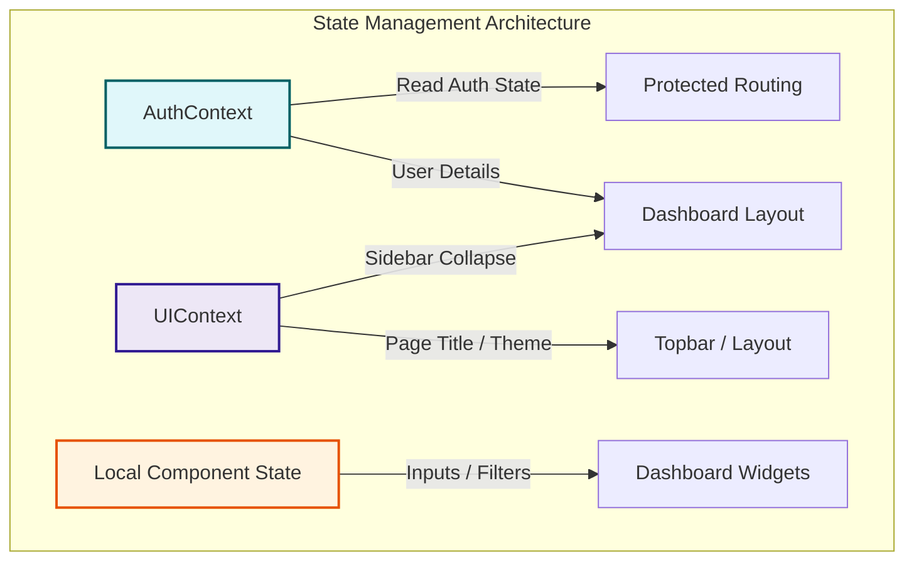
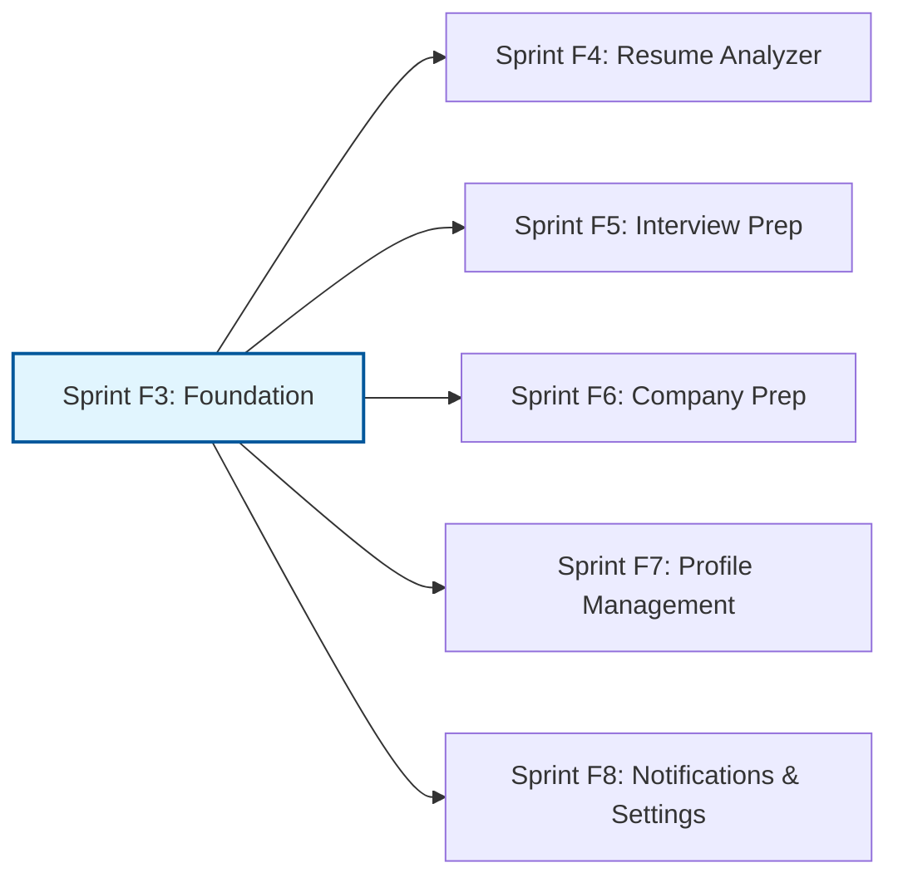

# Sprint F3 Project Plan: Authenticated Dashboard Foundation

## Document Metadata
- **Document Version:** 2.0.0
- **Status:** Under Review (Planning Phase - Post Revision)
- **Target Sprint:** Frontend Sprint F3
- **Primary Focus:** Authenticated Dashboard Foundation
- **Target Date:** August 2026

---

## 1. Sprint Overview
Frontend Sprint F3 marks the transition of the AI Placement Platform from a public-facing informational landing page (completed in Sprint F2) into a secure, stateful, single-page application (SPA).

Following an engineering review, the scope of Sprint F3 has been adjusted to focus exclusively on establishing the **authenticated application foundation**. Rather than implementing multiple complex feature modules, this sprint provides the core layout shell, route authorization, and global state management systems. Features such as the Resume Analyzer, Mock Interview Simulator, and Profile Management will render as placeholder pages or routes. 

By prioritizing the dashboard architecture, navigation system, and responsive shell layout, Sprint F3 delivers a reusable, enterprise-grade foundation. Live REST API integration is scoped strictly to user authentication and session management. The Dashboard Home will utilize a centralized mock data layer to populate its dashboard widgets, ensuring UI development remains modular, fast, and decoupled from concurrent backend operations.

---

## 2. Sprint Objectives
- **Secure Route Authorization & Session Control:** Establish client-side token-based authentication context and protected route guards (`ProtectedRoute`) to prevent unauthorized access.
- **Implement Authenticated Navigation Layout:** Build a fully responsive dashboard layout shell (`DashboardLayout`) featuring a collapsible Sidebar and sticky Topbar with user profile menus.
- **Deliver Dashboard Home with Reusable Widgets:** Build the central student landing view populated by mock-data-driven widgets detailing placement preparation statistics and activities.
- **Establish Scalable State Management:** Implement separate global contexts for security (Auth) and interface layout (UI) states to optimize performance and prevent render cycle overhead.
- **Incorporate Quality & Performance Validation:** Setup automated build, lint, and route verification checks alongside performance validation rules to guarantee build scalability.

---

## 3. Sprint Scope

### In Scope
1. **Client-Side Session Security & Interceptors:**
   - React Context provider for user sessions (`AuthContext`).
   - Axios request interceptor adding token (`Authorization: Bearer <token>`) to HTTP headers.
   - Axios response interceptor capturing `401 Unauthorized` states to force logout and redirect.
   - Secure browser storage handling for JWT persistence.
2. **Dynamic Protected Route Configuration:**
   - Protected Routes requiring active user authentication redirecting unauthorized users to `/login`.
   - Guest-Only Routes (e.g. Login, Register) redirecting authenticated users directly to `/dashboard`.
3. **Responsive Dashboard Shell (`DashboardLayout`):**
   - Collapsible left-side Sidebar containing navigational controls.
   - Sticky Top Bar containing page title indicators and profile actions.
   - User dropdown menu containing quick actions and logout triggers.
   - Full mobile adaptation via slide-out menu drawer.
4. **Dashboard Home Panel:**
   - Grid-based landing view containing mock-data-driven cards.
   - Centralized mock data structure simulating placement statistics.
5. **Reusable Dashboard Widgets:**
   - Welcome Card (User greeting, target role banner, and quick progress indicator).
   - Resume Score Card (ATS score gauge, active checklist status).
   - Applications Card (Job application metrics, active tracking list).
   - Interview Readiness Card (Completed mock tests count, performance gauge).
   - Placement Progress Card (Visual overall readiness indicator).
   - Upcoming Tasks Card (Calendar list of action items, deadlines).
   - Recent Activity Card (Chronological feed of user events).
   - Quick Actions Card (Immediate navigation triggers).

### Out of Scope
1. **Profile Management Integration:** Interactive personal information, academic, and preference forms are postponed. These links will route to static placeholder views.
2. **Settings Implementation:** Password change transactions, preference forms, and subscription updates are postponed to later sprints.
3. **Notification System Backend Integration:** Live database notifications, dynamic counts, and categorization pages are out of scope.
4. **Career Orbit Visualization:** Dynamic SVG orbit mapping, interactive milestone nodes, and custom orbit animations are removed from this sprint.
5. **Resume and Interview Feature Modules:** Active upload, ATS analysis reports, speech-to-text recording, and simulator modules are deferred.

---

## 4. State Management Strategy
To ensure codebase scalability and prevent unnecessary dashboard re-renders, the application state is divided into three distinct layers of responsibility:



### AuthContext
- **Responsibility:** Manages security-related transactions.
- **State Properties:**
  - `currentUser`: User identity payload (id, email, name, role).
  - `token`: Encrypted JWT string.
  - `isAuthenticated`: Boolean status checker.
  - `loading`: Application initialization blocker.
- **Methods:** `login()`, `logout()`, `refreshSession()`.

### UIContext
- **Responsibility:** Manages global interface settings and layout components configurations.
- **State Properties:**
  - `sidebarCollapsed`: Toggle status for desktop navigation sidebar width.
  - `mobileDrawerOpen`: Open/close state of the mobile layout drawer.
  - `currentPageTitle`: Text label rendered in the header bar.
  - `breadcrumbs`: Navigation trail history.
  - `theme`: UI mode configurations (Light vs. Dark layout wrapper).

### Local Component State
- **Responsibility:** Encompasses transient UI details contained within single views or components.
- **Usage:** Managing form inputs, table filters, toggle tabs, and visual animations inside individual dashboard widgets.

### Architectural Rationale
By decoupling security credentials (AuthContext) from interface state (UIContext), changes to layout properties (e.g. collapsing the sidebar) do not trigger authorization re-evaluations or re-render secure business layers. Similarly, localized widget interactions remain isolated, ensuring UX performance.

---

## 5. Sprint Deliverables
- **ProtectedRoute & Route Guards:** Authorization components restricting layout page rendering to valid sessions.
- **AuthContext Provider:** Security state provider and Axios interceptor modules.
- **UIContext Provider:** Global layout settings provider.
- **DashboardLayout Component:** Responsive outer frame containing navigation layouts.
- **Sidebar Navigation:** Collapsible left-side bar containing the following paths:
  1. Dashboard
  2. Resume Analyzer
  3. Interview Preparation
  4. Company Preparation
  5. Applications
  6. Progress
  7. Profile
  8. Settings
  9. Logout
- **Topbar & Header System:** Component displaying page titles, breadcrumbs, hamburger controls, and user dropdown menus.
- **Dashboard Home Page:** Scaffolded grid displaying reusable layout widgets.
- **Mock Data Layer:** Centralized javascript models simulating profile records and application logs.
- **Reusable Dashboard Widgets:** Suite of cards (Welcome Card, Resume Score Card, etc.) displaying mock metrics.

---

## 6. Milestone Breakdown (M1–M8)

### M1: Authentication Foundation
- **Objective:** Setup client-side token management, auth provider hooks, and route boundaries.
- **Deliverables:** `AuthContext`, `ProtectedRoute`, `PublicOnlyRoute`, and configured Axios client wrapper.
- **Dependencies:** Backend Beta v1.0 authentication REST endpoints.
- **Acceptance Criteria:**
  - Direct navigation to `/dashboard` without an active JWT redirects the browser to `/login`.
  - Logging in via the credentials form updates browser localStorage, populates the AuthContext, and redirects to `/dashboard`.
  - Accessing the login page with an active session redirects to `/dashboard`.
- **Technical Notes:** Include JWT payload decoding to track expiration. Axios interceptor must append `Bearer <token>` on all requests and intercept `401 Unauthorized` responses to invoke sign-out methods.

### M2: Dashboard Layout
- **Objective:** Establish the structural layout grid container for authenticated application modules.
- **Deliverables:** `DashboardLayout` container component, root layout theme parameters.
- **Dependencies:** React Router route structures, M1 auth guards.
- **Acceptance Criteria:**
  - Route navigation renders page content within the layout frame while keeping structural headers static.
  - Content container updates size smoothly during page transitions.
- **Technical Notes:** Utilize Material UI layout blocks (`Box`, `Container`, `CssBaseline`) to build the master layout frame.

### M3: Sidebar Navigation
- **Objective:** Implement the navigational controls within the dashboard sidebar.
- **Deliverables:** Collapsible navigation `Sidebar` containing the 9 core paths.
- **Dependencies:** M2 `DashboardLayout` shell.
- **Acceptance Criteria:**
  - Contains paths for Dashboard, Resume Analyzer, Interview Preparation, Company Preparation, Applications, Progress, Profile, Settings, and Logout.
  - Clicking any navigation item updates the active URL path.
  - Sidebar expands and collapses on desktop via UIContext controls.
- **Technical Notes:** Import Lucide React icons for the navigation list. Toggle sidebar width between `260px` and `72px` with CSS transit times matching design tokens.

### M4: Top Navigation
- **Objective:** Build the header controls carrying page locations and user settings.
- **Deliverables:** `Topbar` component, dynamic breadcrumbs, and `UserMenu` profile dropdown actions list.
- **Dependencies:** M2 layout container, `UIContext` providers.
- **Acceptance Criteria:**
  - Header displays the current page title and path breadcrumbs dynamically.
  - Clicking the profile avatar opens the user dropdown menu detailing profile and logout triggers.
- **Technical Notes:** MUI `AppBar` and `Toolbar` controls. Breadcrumbs derived programmatically from the active window location.

### M5: Dashboard Home
- **Objective:** Scaffold the grid container to arrange widgets on the primary landing view.
- **Deliverables:** `DashboardHome` page component with mobile-responsive grids.
- **Dependencies:** M2–M4 navigational shell.
- **Acceptance Criteria:**
  - Navigating to `/dashboard` displays the dashboard grid layout.
  - Widgets arrange dynamically (4 columns on desktop, 2 columns on tablets, 1 column on mobile devices).
- **Technical Notes:** MUI `Grid` components with responsive configurations (`xs={12} sm={6} md={4} lg={3}`).

### M6: Reusable Dashboard Widgets
- **Objective:** Develop the collection of cards to populate the dashboard home.
- **Deliverables:** Collection of widgets (Welcome, Resume, Applications, Interview, Progress, Tasks, Activity, Actions) and the `mockDashboardData` configuration file.
- **Dependencies:** M5 `DashboardHome` layout page.
- **Acceptance Criteria:**
  - Cards display mock data accurately (e.g. Resume Score Card displays ATS Score of 85).
  - Quick action buttons route users to respective placeholder URLs.
  - Widgets contain zero live backend network requests.
- **Technical Notes:** Build components as stateless cards receiving inputs from the mock data layer.

### M7: Responsive Dashboard
- **Objective:** Ensure the entire dashboard shell and widget grids adapt to mobile screens.
- **Deliverables:** Mobile slide-out drawer navigation, topbar hamburger toggle controls.
- **Dependencies:** M3 Sidebar, M4 Topbar, M5 DashboardHome.
- **Acceptance Criteria:**
  - On screen widths below `900px`, the desktop sidebar is hidden, and a hamburger icon appears in the Topbar.
  - Tapping the hamburger slides out the mobile drawer navigation.
  - Layout widget grids stack vertically without horizontal page scrolling.
- **Technical Notes:** MUI temporary `Drawer` configuration responding to the `UIContext` drawer state toggles.

### M8: Dashboard Polish
- **Objective:** Finalize interface transitions, complete validation checks, and verify accessibility compliance.
- **Deliverables:** Micro-interactions UI adjustments, test suite, and handover summary documentation.
- **Dependencies:** M1–M7 functionality.
- **Acceptance Criteria:**
  - Quality and performance validations execute cleanly.
  - Interactive cards display hover elevation states.
  - Focus outlines are visible during keyboard tab actions.
- **Technical Notes:** Hover effects implemented via Material UI CSS states. Disable animations programmatically when reduced-motion preferences are checked.

---

## 7. Dependencies

### External Dependencies
1. **Authentication API Stability:** The Backend Beta v1.0 REST API authentication endpoints (`/auth/login`, `/auth/register`) must remain operational and stable on local or sandbox host environments.
2. **No Live Dashboard APIs:** Dashboard Home widgets will rely entirely on local mock data. Live integration for these modules is out of scope for Sprint F3.

### Package Dependencies
- **React Router DOM (v6):** Routing framework managing page boundaries and layout wrappers.
- **Material UI (v5):** Design components library.
- **Lucide React:** Icon set for navigation links.
- **Axios:** HTTP client managing network requests and global interceptors.
- **React Hook Form & Zod:** Libraries handling validation schemas.
- **Framer Motion:** Animation engine rendering hover states and sidebar transitions.
- **jwt-decode:** Decoder verifying JWT claims client-side.

---

## 8. Technical Risks & Mitigations

| Risk Description | Impact | Probability | Mitigation Strategy |
| :--- | :--- | :--- | :--- |
| **Token Lifecycle Sync Errors:** Server session expires, but client fails to catch it, leading to silent form submission failures. | High | Medium | Implement an Axios response interceptor that automatically catches `401 Unauthorized` responses, clears local storage, and redirects the user to the login screen with a toast alert. |
| **Mock-to-API Sync Transition Complexity:** Transitioning widgets from mock data to real API endpoints in future sprints could require significant refactoring. | Medium | Medium | Define standardized interface types (TypeScript definitions) for mock data models that mirror backend database entities. Developers will swap the data source at the hook layer without touching the presentation widgets. |
| **Multi-Context Rendering Overhead:** Maintaining separate `AuthContext` and `UIContext` triggers unnecessary layout repaints on child pages. | Low | Medium | Restructure context consumers carefully. Ensure widgets only consume properties they require, and memoize expensive layouts using `React.memo` wrappers. |
| **CORS and Session Inconsistencies:** Domain configuration mismatch between backend API endpoints and local frontend clients prevents secure storage cookies or headers. | High | Medium | Configure Axios base URL values dynamically using environment variables (`.env.development` / `.env.production`). Ensure CORS configuration on the Spring Boot backend allows requests from the frontend client's domain. |

---

## 9. Performance Targets
The following metrics are defined as engineering optimization targets rather than mandatory completion criteria:
- **Performance Targets:**
  - Lighthouse Performance Score: **> 85**
  - First Contentful Paint (FCP): **< 2.0 seconds**
  - Time to Interactive (TTI): **< 3.0 seconds**
  - Cumulative Layout Shift (CLS): **< 0.1**
- **Quality Validation Categories:**
  - *Build Check:* Zero compilation errors during standard production build outputs.
  - *Lint Audits:* Zero warnings or errors in ESLint runs.
  - *Routing Guards:* Secure validation verifying non-authenticated traffic is redirected away from `/dashboard`.
  - *Responsive Viewports:* Manual validation verifying dashboard grids adapt correctly to 375px, 768px, 1024px, and 1440px viewport widths.
  - *Accessibility Checklist:* Keyboard accessibility verification ensuring focused inputs are highlighted.
- **Performance Validation Categories:**
  - *Code Splitting:* Ensure dashboard page bundles are lazy-loaded via dynamic imports.
  - *Bundle Audits:* Keep the index bundle chunk sizes below **500 KB**.

---

## 10. Definition of Done (DoD)
Every milestone and feature item delivered in Sprint F3 must satisfy the following conditions before being marked as complete:
- **Development:** Code complies with the project's folder structure, styling guidelines, and functional components patterns. No debugging tools or console logging remain in production files.
- **Testing:** Unit tests cover authentication context helpers and protected routing rules.
- **Validation:** Passes all Quality Validation and Performance Validation checks.
- **Documentation:** Structural comments explain complex routing behaviors. The sprint handover documentation is updated within the `docs/frontend/Sprint_F3` directory.
- **Git Control:** Code changes are committed in structured units referencing feature flags. The code is merged into the main development branch after successful code review.

---

## 11. Sprint Timeline (Logical Sequencing)

```mermaid
gantt
    title Sprint F3 Gantt Chart & Milestone Timeline
    dateFormat  YYYY-MM-DD
    axisFormat  W%W - D%d
    
    section Foundation & Security
    M1: Auth Foundation           :active, m1, 2026-08-01, 5d
    M2: Dashboard Layout          :after m1, m2, 5d
    
    section Navigation Shell
    M3: Sidebar Navigation        :after m2, m3, 4d
    M4: Top Navigation            :after m3, m4, 4d
    
    section Dashboard views
    M5: Dashboard Home            :after m4, m5, 3d
    M6: Dashboard Widgets         :after m5, m6, 5d
    
    section Optimization
    M7: Responsive Dashboard      :after m6, m7, 3d
    M8: Dashboard Polish          :after m7, m8, 4d
```

### Sequencing Details
- **Week 1 (M1 & M2):** Focus on the security foundations and structural layout. Secure routing boundaries must be verified before displaying UI elements.
- **Week 2 (M3 & M4):** Implement navigation systems. Collapsible side controls and header controls are developed and synced to routing logs.
- **Week 3 (M5 & M6):** Scaffold the home grid layout and write the reusable mock cards library.
- **Week 4 (M7 & M8):** Optimize layouts across viewport sizes and apply polishing metrics before final testing checks.

---

## 12. Future Sprint Mapping
To align development teams on feature milestones, Frontend Sprint F3 establishes the architectural framework that subsequent sprints build upon:



- **Sprint F4: Resume Analyzer**
  - Integrate PDF upload drop zones.
  - Implement ATS scoring feedback displays, weaknesses, and improvement lists.
  - Connect layout page `/resume` to backend resume APIs.
- **Sprint F5: Interview Preparation**
  - Construct interview selector forms.
  - Setup AI conversational cards.
  - Connect page `/interview` to interview simulator APIs.
- **Sprint F6: Company Preparation**
  - Develop company profiles log grids and interview preparation cards.
  - Connect page `/company` to company description endpoints.
- **Sprint F7: Profile Management**
  - Implement the tabbed profile forms (Personal, Academic, Career Preferences).
  - Connect page `/profile` to GET/PUT `/profile` endpoints.
- **Sprint F8: Notifications & Settings**
  - Connect the header menu controls to the notifications databases.
  - Implement dynamic user preference panels and billing subscription views.

---

## 13. Assumptions
- **Stable REST Endpoints:** The Backend Beta v1.0 authentication (`/auth/login`, `/auth/register`) REST endpoints are fully functional, stable, and run locally on port `8080`.
- **Design Tokens Consistency:** Typography sizing, spacing grids, and color token configurations established in Sprint F1 and F2 remain unchanged.
- **Mock Data Sufficiency:** Structured mock data files are sufficient for populating the dashboard home view, allowing live backend integration for other screens to occur incrementally in later sprints.
- **Platform Role:** The default role is set to `STUDENT`, as configured in user specifications.
